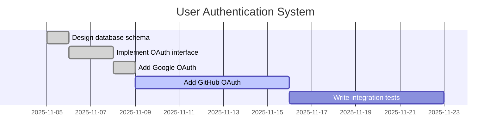

# Export Project

**Export a project to Markdown, JSON, or Gantt chart format.**

Phase 3 UX Enhancement: Export for reporting and sharing.

---

## Usage

```
/export <master_task_id> [format] [options]
```

**Arguments:**
- `master_task_id` - ID of the master task/project to export
- `format` - Export format: markdown (default), json, gantt
- `options` - Additional options (see below)

---

## Export Formats

### Markdown (Default)

Exports project as a formatted Markdown document with:
- Project title and metadata
- Context summary
- Hierarchical task list with checkboxes
- Completion statistics

**Example:**
```
/export 45
/export 45 markdown
```

**Output:**
```markdown
# User Authentication System

**Status:** in_progress | **Progress:** 78%
**Created:** 2025-11-05
**Completed:** Not yet

## Summary
Building OAuth authentication system with Google and GitHub providers...

## Tasks
- [x] Design database schema **HIGH**
- [x] Implement OAuth provider interface
- [x] Add Google OAuth integration
- [ ] Add GitHub OAuth integration
- [ ] Write integration tests

## Statistics
- **Total Tasks:** 8
- **Completed:** 6
- **Remaining:** 2
- **Completion:** 78%
```

### JSON

Exports complete project data structure for programmatic use.

**Example:**
```
/export 45 json
```

**Output:**
```json
{
  "master_task": {
    "id": 45,
    "title": "User Authentication System",
    "status": "in_progress",
    "priority": "high",
    "context_summary": "Building OAuth...",
    "created_at": "2025-11-05T10:00:00",
    "completion_percentage": 78
  },
  "tasks": [
    {
      "id": 46,
      "content": "Design database schema",
      "status": "completed",
      "priority": "high",
      "depth_level": 1,
      "parent_task_id": 45
    },
    ...
  ],
  "statistics": {
    "total_tasks": 8,
    "completed_tasks": 6,
    "completion_percentage": 78
  }
}
```

### Gantt Chart

Exports project as Mermaid Gantt chart for timeline visualization.

**Example:**
```
/export 45 gantt
```

**Output:**


---

## How It Works

### Step 1: Parse Arguments

```
Examples:
/export 45                    # Default: Markdown
/export 45 json               # Export as JSON
/export 45 gantt              # Export as Gantt chart
/export 45 markdown save      # Save to file
```

### Step 2: Get Project Data

```
Use the task-tracker MCP tool export_project with:
- master_task_id: [parsed ID]
- format: [markdown/json/gantt]
- include_completed: true (default)
- output_path: [optional file path]
```

### Step 3: Display or Save

**Display in terminal (default):**
```
================================================================================
                    EXPORT: User Authentication System
================================================================================

Format: Markdown
Tasks: 8 total (6 completed, 2 remaining)
Progress: 78%

[... exported content ...]

Export complete!
================================================================================
```

**Save to file (if 'save' option provided):**
```
Use the task-tracker MCP tool export_project with:
- output_path: "PROJECT_{id}_{timestamp}.{ext}"

Example paths:
- PROJECT_45_20251112.md
- PROJECT_45_20251112.json
- PROJECT_45_20251112_gantt.md
```

Display result:
```
================================================================================
                    EXPORT SAVED
================================================================================

Format: Markdown
File: /path/to/PROJECT_45_20251112.md
Tasks: 8 total
Progress: 78%

Export saved successfully!
================================================================================
```

---

## Examples

**Quick export to view:**
```
/export 45
```

**Export as JSON:**
```
/export 45 json
```

**Export Gantt chart:**
```
/export 45 gantt
```

**Save to file:**
```
/export 45 markdown save
/export 45 json save
/export 45 gantt save
```

**Specific file path:**
```
/export 45 markdown path:/Users/user/Documents/auth_project.md
/export 45 json path:./exports/project_45.json
```

---

## Use Cases

### 1. Status Reports

Export project for stakeholder updates:
```
/export 45 markdown save
# Email the generated PROJECT_45_*.md file
```

### 2. Documentation

Generate project documentation:
```
/export 45 markdown
# Copy output to project README or wiki
```

### 3. Data Analysis

Export for analysis in external tools:
```
/export 45 json save
# Import JSON into analytics tool
```

### 4. Timeline Visualization

Create visual project timeline:
```
/export 45 gantt save
# View Gantt chart in GitHub/Markdown viewer
```

### 5. Archiving

Save project snapshot before archiving:
```
/export 45 markdown save
/export 45 json save
/archive 45 46 47 48 49 50
```

---

## Options

### Include/Exclude Completed Tasks

**Include completed (default):**
```
/export 45 markdown
```

**Exclude completed (only pending/in-progress):**
```
/export 45 markdown active-only
```

### Custom File Paths

**Auto-generated path:**
```
/export 45 save
# Saves to: PROJECT_45_20251112.md
```

**Custom path:**
```
/export 45 markdown path:~/Documents/auth_status.md
/export 45 json path:/Users/user/exports/project.json
```

---

## Implementation Details

**Markdown Export Features:**
- Full task hierarchy with indentation
- Checkbox format for task status
- Priority badges for high/critical
- Notes attached to tasks
- Summary statistics

**JSON Export Features:**
- Complete task data structure
- Relationships (parent_task_id)
- Timestamps (created_at, completed_at)
- Metadata (depth_level, notes)
- Programmatically parseable

**Gantt Chart Features:**
- Timeline visualization
- Status indicators (done/active)
- Date-based scheduling
- Mermaid format (GitHub/Markdown compatible)
- Estimated end dates for incomplete tasks

---

## Related Commands

- `/report` - Generate weekly/monthly summary reports
- `/tasks by-project <id>` - View tasks in a project
- `/resume <id>` - Jump to project
- `/archive` - Archive completed tasks

---

*Command Purpose:* Export projects for reporting, documentation, and sharing
*Created:* 2025-11-12 (Phase 3)
*Enhancement:* Export capabilities for improved collaboration