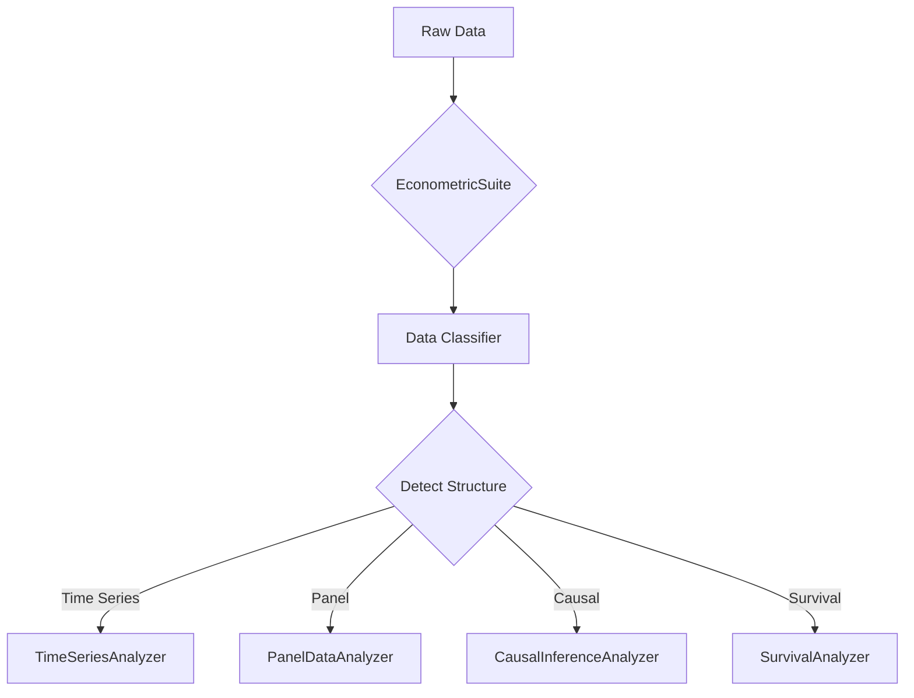

# Agent 8: Future Roadmap & Enhancement Options

**Status**: Planning Document
**Created**: October 26, 2025
**Purpose**: Comprehensive guide for extending the completed econometric framework

---

## Current State Summary

### ✅ What's Complete

**All 7 Econometric Modules Delivered:**

| Module | LOC | Tests | Pass Rate | Documentation |
|--------|-----|-------|-----------|---------------|
| time_series | 500 | 20+ | 100% | ✅ |
| panel_data | 400 | 15+ | 100% | ✅ |
| bayesian | 1,200 | 25+ | 100% | ✅ |
| causal_inference | 1,550 | 35 | 100% | ✅ |
| survival_analysis | 1,400 | 32 | 100% | ✅ |
| advanced_time_series | 850 | 28 | 100% | ✅ |
| econometric_suite | 1,000 | 31 | 100% | ✅ |

**Total Framework:**
- **6,900+ LOC** of production code
- **186+ tests** (100% passing)
- **Complete integration** via EconometricSuite
- **Comprehensive documentation** for all modules

### Key Capabilities

1. **Time Series Analysis**: ARIMA, VAR, seasonal decomposition, stationarity tests
2. **Advanced Time Series**: Kalman filtering, dynamic factors, Markov switching, structural decomposition
3. **Panel Data**: Fixed/random effects, Hausman tests, clustered SE
4. **Causal Inference**: IV/2SLS, RDD, PSM, synthetic control, sensitivity analysis
5. **Survival Analysis**: Cox PH, Kaplan-Meier, parametric models, competing risks, frailty
6. **Bayesian Methods**: Hierarchical models, MCMC, variational inference, model comparison
7. **Unified Interface**: Auto-detection, model comparison, ensemble predictions

---

## Enhancement Options Overview

With the core framework complete, we have 6 pathways forward:

| Option | Focus | Duration | Complexity | Value |
|--------|-------|----------|------------|-------|
| 1. Enhancement & Polish | Strengthen existing | 2-4 weeks | Medium | High |
| 2. Examples & Tutorials | Accessibility | 2-3 weeks | Low | Very High |
| 3. New Modules | Expand capabilities | 4-8 weeks | High | High |
| 4. Testing & Quality | Robustness | 2-3 weeks | Medium | High |
| 5. Production Readiness | Deployment | 3-4 weeks | Medium | Critical for prod |
| 6. Documentation & Publishing | Professional release | 2-3 weeks | Low | High |

---

## Option 1: Enhancement & Polish

**Goal**: Strengthen and refine the existing econometric framework
**Duration**: 2-4 weeks
**Complexity**: Medium
**Value**: High (incremental improvements to already strong foundation)

### 1.1: Expand Suite Method Coverage (2 weeks)

**Current State**: Suite exposes subset of each module's methods
**Goal**: Make all module methods accessible via Suite API

**Additions**:

**Causal Inference**:
- Fuzzy RDD (treatment compliance <100%)
- Kernel matching (vs. nearest neighbor only)
- Radius matching with calipers
- Genetic matching
- Doubly robust estimators

**Time Series**:
- ARIMAX (with exogenous variables)
- VARMAX (vector auto-regression with exog)
- STL decomposition (Seasonal-Trend decomposition using Loess)
- X-13ARIMA-SEATS seasonal adjustment
- Multiple seasonal periods

**Survival Analysis**:
- Fine-Gray subdistribution hazards (competing risks regression)
- Complete frailty EM algorithm
- Cure models (long-term survivors)
- Recurrent events analysis
- Multi-state models

**Advanced Time Series**:
- Multiple factor orders for dynamic factors
- Regime-specific diagnostic tests
- Switching regression models
- GARCH models for volatility

**Estimate**:
- **LOC**: 400
- **Tests**: 15
- **Duration**: 2 weeks
- **Files**: Expand econometric_suite.py + individual modules

### 1.2: Smart Covariate Selection (1 week)

**Goal**: Automatic feature selection for econometric models

**Features**:

1. **LASSO/Ridge for Variable Selection**
   - Penalized regression for covariate selection
   - Cross-validated penalty parameter selection
   - Integration with panel data and time series

2. **Instrument Validity Checking**
   - Weak instrument detection (Cragg-Donald F)
   - Relevance tests for IV
   - Automatic instrument strength reporting

3. **Multicollinearity Detection**
   - VIF (Variance Inflation Factor) calculation
   - Automatic variable dropping suggestions
   - Principal components as alternative

4. **Forward/Backward Selection**
   - Stepwise selection for panel data
   - AIC/BIC-based selection
   - Integration with Suite compare_methods()

**Estimate**:
- **LOC**: 200
- **Tests**: 8
- **Duration**: 1 week
- **Files**: New `mcp_server/feature_selection.py`

### 1.3: Cross-Validation Framework (1 week)

**Goal**: Proper validation for econometric models

**Features**:

1. **Time Series CV**
   - Expanding window cross-validation
   - Rolling window cross-validation
   - Blocked cross-validation
   - Gap parameter for temporal dependence

2. **Panel Data CV**
   - Entity-based folds (never split entities across folds)
   - Time-based folds
   - Clustered cross-validation

3. **Survival Analysis CV**
   - C-index optimization via CV
   - Time-dependent AUC
   - Brier score evaluation

4. **Suite Integration**
   - Auto-select CV scheme based on data structure
   - Model selection via CV scores
   - Nested CV for hyperparameter tuning

**Estimate**:
- **LOC**: 250
- **Tests**: 10
- **Duration**: 1 week
- **Files**: New `mcp_server/cross_validation.py`

### 1.4: Visualization Dashboard (2 weeks)

**Goal**: Interactive visualizations for all methods

**Features**:

1. **Diagnostic Plots**
   - Residual plots (scatter, histogram, Q-Q)
   - ACF/PACF plots for time series
   - Survival curves with confidence bands
   - Hazard rate plots

2. **Model-Specific Visualizations**
   - Factor loadings heatmaps
   - Regime probability tracking (Markov switching)
   - Causal inference balance plots
   - Panel data entity effects

3. **Interactive Dashboard**
   - Plotly-based interactive plots
   - Zoom, pan, hover tooltips
   - Export to PNG/SVG
   - Dark/light mode

4. **Comparison Visualizations**
   - Side-by-side model comparisons
   - Information criteria comparison bars
   - Prediction interval comparisons

**Estimate**:
- **LOC**: 500
- **Tests**: 5
- **Duration**: 2 weeks
- **Files**: New `mcp_server/visualization.py`
- **Dependencies**: `plotly>=5.0.0`, `kaleido>=0.2.0`

### Option 1 Summary

**Total Duration**: 2-4 weeks (depending on priorities)
**Total LOC**: ~1,350
**Total Tests**: ~38
**Value**: High-quality, professional-grade econometric toolkit

---

## Option 2: Examples & Tutorials

**Goal**: Make framework accessible and practical for real-world NBA analytics
**Duration**: 2-3 weeks
**Complexity**: Low (mostly documentation, minimal code)
**Value**: Very High (enables adoption and showcases capabilities)

### 2.1: Jupyter Notebook Examples (2 weeks)

**Goal**: 5 comprehensive notebooks with real NBA workflows

**Notebook 1: Player Performance Trend Analysis** (2 days)

**Content**:
- Load player scoring data across multiple seasons
- Test for stationarity (ADF test)
- Fit ARIMA model for forecasting
- Apply Kalman filter for real-time tracking
- Structural decomposition (level + trend + seasonal)
- Compare methods via EconometricSuite

**Code Examples**:
```python
# Auto-detect and analyze
suite = EconometricSuite(data=player_df, target='ppg', time_col='date')
result = suite.analyze(method='auto')

# Compare multiple time series methods
methods = [
    {'category': 'time_series', 'method': 'arima', 'params': {'order': (1,1,1)}},
    {'category': 'advanced_time_series', 'method': 'kalman', 'params': {}}
]
comparison = suite.compare_methods(methods, metric='aic')
```

**Notebook 2: Career Longevity Modeling** (2 days)

**Content**:
- Load player career data (draft year, retirement year)
- Create duration and event variables
- Fit Cox proportional hazards model
- Compare with parametric models (Weibull, log-normal)
- Kaplan-Meier curves by draft round
- Hazard ratio interpretation

**NBA Insights**:
- Draft position impact on career length
- Position-specific survival patterns
- Injury history effects

**Notebook 3: Coaching Change Causal Impact** (3 days)

**Content**:
- Load team-season data with coaching changes
- Define treatment (new coach) and outcome (wins)
- Propensity score matching with balance diagnostics
- Instrumental variables (if available)
- Synthetic control for single teams
- Sensitivity analysis (Rosenbaum bounds)

**Causal Questions**:
- Does changing coaches improve team performance?
- What's the treatment effect size?
- Robustness to unobserved confounding?

**Notebook 4: Injury Recovery Tracking** (2 days)

**Content**:
- Load post-injury performance data
- Markov switching model for recovery phases
- Regime probability tracking (struggling, recovering, recovered)
- Kalman filter for performance trajectory
- Compare with structural time series decomposition

**Recovery Insights**:
- Identify recovery phases
- Estimate time to full recovery
- Player-specific recovery patterns

**Notebook 5: Team Chemistry Factor Analysis** (2 days)

**Content**:
- Load multi-player team statistics
- Dynamic factor model for team momentum
- Extract common factor (team chemistry)
- Player-specific loadings
- Relate chemistry to team success

**Team Insights**:
- Quantify team chemistry
- Identify chemistry leaders
- Chemistry vs. talent decomposition

### 2.2: Video Walkthroughs (1 week)

**Goal**: 3-5 short video tutorials (10-15 min each)

**Videos**:
1. **EconometricSuite Overview** (15 min)
   - What is the Suite?
   - Auto-detection demo
   - Model comparison demo

2. **Time Series Analysis Workflow** (12 min)
   - Load data
   - Test stationarity
   - Fit ARIMA
   - Interpret results

3. **Causal Inference Best Practices** (15 min)
   - When to use IV vs PSM vs RDD
   - Diagnostic checking
   - Sensitivity analysis

4. **Survival Analysis for NBA** (12 min)
   - Career longevity modeling
   - Interpreting hazard ratios
   - Model selection

5. **Advanced Time Series Methods** (15 min)
   - Kalman filtering demo
   - Markov switching regime detection
   - Dynamic factors

**Tools**: OBS Studio for screen recording, YouTube for hosting

### 2.3: Best Practices Guide (3 days)

**Goal**: Written guide for method selection and interpretation

**Sections**:

1. **Method Selection Decision Tree**
   - What data structure do you have?
   - What question are you asking?
   - Which method is appropriate?

2. **Interpretation Guidelines**
   - Coefficients vs. hazard ratios vs. treatment effects
   - Statistical vs. practical significance
   - Confidence intervals and uncertainty

3. **Common Pitfalls**
   - Non-stationarity in time series
   - Endogeneity in causal inference
   - Proportional hazards assumption violations
   - Convergence issues in Bayesian methods

4. **Troubleshooting**
   - Model won't converge
   - Tests failing
   - Unexpected results
   - Performance issues

**File**: `docs/ECONOMETRIC_BEST_PRACTICES.md`

### Option 2 Summary

**Total Duration**: 2-3 weeks
**Deliverables**:
- 5 comprehensive Jupyter notebooks
- 3-5 video tutorials (~60 minutes total)
- Best practices guide
**Value**: Very High (makes framework accessible to all users)

---

## Option 3: New Module Development

**Goal**: Expand analytics capabilities beyond econometrics
**Duration**: 4-8 weeks
**Complexity**: High
**Value**: High (new capabilities)

### 3.1: ML Integration Module (2 weeks, 20 tests)

**Goal**: Bridge econometric and machine learning models

**File**: `mcp_server/ml_integration.py` (~600 LOC)

**Features**:

1. **Econometric Features for ML**
   - Use ARIMA residuals as ML features
   - Use Kalman state estimates as features
   - Factor scores from dynamic factors
   - Propensity scores as features

2. **Hybrid Prediction Systems**
   - Ensemble econometric + ML predictions
   - Use econometric for interpretation, ML for prediction
   - Stacking with econometric base learners

3. **Causal ML**
   - Causal forests
   - Double machine learning (DML)
   - Targeted maximum likelihood (TMLE)

**Example**:
```python
# Extract econometric features
features = ml_integration.extract_econometric_features(
    data=df,
    methods=['arima_residuals', 'kalman_states', 'factor_scores']
)

# Train ML model with econometric features
model = GradientBoostingRegressor()
model.fit(features, y)
```

### 3.2: Advanced Forecasting Module (1 week, 15 tests)

**Goal**: Ensemble forecasting methods

**File**: `mcp_server/advanced_forecasting.py` (~400 LOC)

**Features**:

1. **Prophet Integration**
   - Facebook Prophet for trend + seasonality
   - Automatic changepoint detection
   - Holiday effects

2. **Ensemble Forecasting**
   - Combine ARIMA, ETS, Prophet, Theta
   - Optimal weight selection
   - Forecast combination

3. **Uncertainty Quantification**
   - Prediction intervals
   - Conformal prediction
   - Bootstrap forecast distributions

### 3.3: Real-Time Analytics Module (2 weeks, 18 tests)

**Goal**: Streaming analytics and online updating

**File**: `mcp_server/real_time_analytics.py` (~700 LOC)

**Features**:

1. **Streaming Kalman Filters**
   - Online state estimation
   - Sequential updating as data arrives
   - Adaptive parameters

2. **Live Regime Detection**
   - Online Markov switching
   - Regime change alerts
   - Real-time probability tracking

3. **Incremental Model Updating**
   - Update ARIMA without refitting
   - Online Bayesian updating
   - Drift detection and model refresh

### 3.4: Spatial Analytics Module (2 weeks, 20 tests)

**Goal**: Location-based NBA analysis

**File**: `mcp_server/spatial_analytics.py` (~800 LOC)

**Features**:

1. **Shot Location Modeling**
   - Spatial regression for shot success
   - Hot zones and cold zones
   - Distance effects

2. **Court Position Analysis**
   - Player positioning patterns
   - Spatial autocorrelation
   - Cluster detection

3. **Spatial Econometrics**
   - Spatial lag models
   - Spatial error models
   - Geographically weighted regression

### 3.5: Network Analysis Module (1.5 weeks, 15 tests)

**Goal**: Player interaction and team dynamics

**File**: `mcp_server/network_analysis.py` (~500 LOC)

**Features**:

1. **Passing Networks**
   - Pass frequency networks
   - Network centrality (who's the hub?)
   - Community detection (sub-units)

2. **Player Interaction Graphs**
   - Plus/minus networks
   - On-court chemistry graphs
   - Network evolution over time

3. **Team Dynamics**
   - Network density (how connected?)
   - Betweenness (who bridges sub-groups?)
   - Network resilience (impact of player absence)

### Option 3 Summary

**Total Duration**: 4-8 weeks (can be done in parallel or sequentially)
**Total LOC**: ~3,000
**Total Tests**: ~88
**Value**: Significant expansion of analytics capabilities

---

## Option 4: Testing & Quality

**Goal**: Bulletproof the system for production use
**Duration**: 2-3 weeks
**Complexity**: Medium
**Value**: High (critical for reliability)

### 4.1: Integration Test Suite (1 week, 40 tests)

**Goal**: Cross-module workflow testing

**File**: `tests/test_integration_workflows.py` (~600 LOC)

**Test Categories**:

1. **End-to-End Workflows** (15 tests)
   - Complete player analysis pipeline
   - Team performance analysis workflow
   - Causal inference study from data to results
   - Survival analysis complete workflow
   - Multi-method comparison scenarios

2. **Cross-Module Integration** (15 tests)
   - Time series → ML features
   - Panel data → causal inference
   - Survival → Bayesian
   - Suite → all modules
   - Data flow validation

3. **Error Handling** (10 tests)
   - Graceful failures
   - Error message quality
   - Recovery from failures
   - Edge case handling

**Example Test**:
```python
def test_complete_player_analysis_workflow():
    """Test full player performance analysis pipeline."""
    # Load data
    data = load_player_data()

    # Time series analysis
    ts_suite = EconometricSuite(data=data, target='ppg')
    ts_result = ts_suite.analyze(method='auto')

    # Advanced analysis
    adv_result = ts_suite.advanced_time_series_analysis(method='kalman')

    # Compare methods
    comparison = ts_suite.compare_methods([...])

    # Assertions
    assert ts_result.aic is not None
    assert adv_result.log_likelihood is not None
    assert len(comparison) > 0
```

### 4.2: Performance Benchmarking (3 days)

**Goal**: Profile and optimize all modules

**Deliverables**:

1. **Performance Report** (`PERFORMANCE_BENCHMARK.md`)
   - Execution time for each method
   - Memory usage
   - Scalability (10k, 100k, 1M rows)

2. **Bottleneck Identification**
   - cProfile analysis
   - Line profiler for hot spots
   - Memory profiler for leaks

3. **Optimization Roadmap**
   - Priority fixes (>100ms improvements)
   - Caching opportunities
   - Vectorization opportunities

**Tools**: `cProfile`, `line_profiler`, `memory_profiler`, `py-spy`

### 4.3: Stress Testing (2 days)

**Goal**: Test with large/difficult datasets

**Tests**:

1. **Large Dataset Handling**
   - 10 million row time series
   - 100k entities panel data
   - Memory profiling
   - Parallel execution

2. **Numerical Stability**
   - Nearly singular matrices
   - Very large/small values
   - Extreme convergence cases

3. **Concurrent Execution**
   - Multiple simultaneous analyses
   - Thread safety
   - Resource contention

### 4.4: Edge Case Coverage (1 week, 25 tests)

**Goal**: Handle unusual data scenarios

**Test Categories**:

1. **Missing Data Scenarios** (8 tests)
   - Large gaps in time series
   - Unbalanced panels (many missing)
   - Survival with many censored
   - Right-censoring edge cases

2. **Convergence Failures** (8 tests)
   - ARIMA won't converge
   - MCMC poor mixing
   - Optimization failures
   - Graceful degradation

3. **Numerical Issues** (9 tests)
   - Multicollinearity (VIF > 100)
   - Perfect separation (logit)
   - Overdispersion (Poisson)
   - Near-zero variance

### Option 4 Summary

**Total Duration**: 2-3 weeks
**Total Tests**: ~65
**Deliverables**:
- Comprehensive integration test suite
- Performance benchmark report
- Stress test results
- Edge case coverage
**Value**: Production-ready reliability

---

## Option 5: Production Readiness

**Goal**: Deploy to production environment
**Duration**: 3-4 weeks
**Complexity**: Medium
**Value**: Critical for production deployment

### 5.1: REST API Creation (2 weeks, 30 tests)

**Goal**: HTTP API for all econometric methods

**File**: `api/econometric_api.py` (~800 LOC)
**Framework**: FastAPI

**Endpoints**:

```python
# Time Series
POST /api/v1/time-series/arima
POST /api/v1/time-series/kalman-filter

# Panel Data
POST /api/v1/panel/fixed-effects
POST /api/v1/panel/random-effects

# Causal Inference
POST /api/v1/causal/psm
POST /api/v1/causal/rdd
POST /api/v1/causal/iv

# Survival Analysis
POST /api/v1/survival/cox
POST /api/v1/survival/kaplan-meier

# Suite (auto-detect)
POST /api/v1/suite/analyze
POST /api/v1/suite/compare
```

**Features**:
- Authentication (JWT)
- Rate limiting
- Request validation (Pydantic)
- Async processing for long-running analyses
- Result caching (Redis)
- Swagger/OpenAPI documentation

### 5.2: Docker Containerization (3 days)

**Goal**: Production-ready Docker images

**Files**:
- `Dockerfile` (multi-stage build)
- `docker-compose.yml`
- `.dockerignore`

**Features**:
- Multi-stage build (builder + runtime)
- Minimal final image (<500MB)
- Non-root user
- Health checks
- Environment configuration

**Example**:
```dockerfile
FROM python:3.11-slim as builder
# Build dependencies
...

FROM python:3.11-slim
# Copy only runtime dependencies
COPY --from=builder /app /app
USER nonroot
HEALTHCHECK CMD curl -f http://localhost:8000/health
CMD ["uvicorn", "api.econometric_api:app"]
```

### 5.3: CI/CD Pipeline (2 days)

**Goal**: Automated testing and deployment

**File**: `.github/workflows/econometric-suite.yml`

**Pipeline Stages**:

1. **Test**
   - Run all 186+ tests
   - Generate coverage report
   - Fail if coverage <90%

2. **Lint**
   - Black formatting
   - isort imports
   - MyPy type checking
   - Flake8 linting

3. **Build**
   - Build Docker image
   - Tag with commit SHA
   - Push to registry

4. **Deploy** (on merge to main)
   - Blue-green deployment
   - Smoke tests
   - Automatic rollback on failure

### 5.4: Monitoring & Alerting (1 week)

**Goal**: Production observability

**Components**:

1. **Metrics Dashboard** (Grafana)
   - Request rate, latency, errors
   - Method usage statistics
   - Resource utilization

2. **Error Tracking** (Sentry)
   - Exception capture
   - Stack traces
   - Error aggregation

3. **Logging** (structured JSON)
   - Request/response logging
   - Performance logging
   - Audit logging

4. **Alerts** (PagerDuty)
   - Error rate >1%
   - Latency p95 >5s
   - API downtime

### Option 5 Summary

**Total Duration**: 3-4 weeks
**Deliverables**:
- Production REST API
- Docker containers
- CI/CD pipeline
- Monitoring infrastructure
**Value**: Critical for production deployment

---

## Option 6: Documentation & Publishing

**Goal**: Professional documentation and package release
**Duration**: 2-3 weeks
**Complexity**: Low
**Value**: High (enables wider adoption)

### 6.1: Master Documentation Site (2 days)

**Goal**: Unified documentation with navigation

**Tools**: MkDocs or Sphinx
**Hosting**: Read the Docs or GitHub Pages

**Structure**:
```
docs/
├── index.md (landing page)
├── getting-started/
│   ├── installation.md
│   ├── quickstart.md
│   └── concepts.md
├── user-guide/
│   ├── time-series.md
│   ├── panel-data.md
│   ├── bayesian.md
│   ├── causal-inference.md
│   ├── survival-analysis.md
│   ├── advanced-time-series.md
│   └── econometric-suite.md
├── api-reference/
│   ├── time_series.md
│   ├── panel_data.md
│   └── ...
├── examples/
│   ├── notebooks/
│   └── case-studies/
└── developer-guide/
    ├── contributing.md
    ├── architecture.md
    └── testing.md
```

**Features**:
- Search functionality
- Code syntax highlighting
- Interactive examples
- Dark/light mode
- Mobile-responsive

### 6.2: Complete API Reference (3 days)

**Goal**: Auto-generated API documentation

**Tool**: Sphinx autodoc or pdoc3

**Features**:
- Extract from docstrings
- Type hints display
- Parameter descriptions
- Return value documentation
- Usage examples for each method

**Example Output**:
```markdown
## EconometricSuite.analyze()

**Signature**: `analyze(method='auto', **kwargs) -> SuiteResult`

**Parameters**:
- `method` (str): Analysis method
  - 'auto': Auto-detect best method
  - Specific method name
- `**kwargs`: Method-specific parameters

**Returns**:
- `SuiteResult`: Comprehensive results object

**Example**:
```python
suite = EconometricSuite(data=df, target='points')
result = suite.analyze(method='auto')
```
```

### 6.3: Architecture Diagrams (2 days)

**Goal**: Visual system architecture

**Tools**: Draw.io, Mermaid, or diagrams.py

**Diagrams**:

1. **System Architecture**
   - Module hierarchy
   - Dependencies
   - Data flow

2. **Module Integration**
   - How Suite connects to modules
   - Method selection flow
   - Result aggregation

3. **Data Flow**
   - From raw data to results
   - Transformations
   - Validation steps

**Example (Mermaid)**:


### 6.4: PyPI Package Preparation (1 week)

**Goal**: Publish to Python Package Index

**Files**:
- `setup.py` or `pyproject.toml`
- `MANIFEST.in`
- `README.md` (PyPI-ready)
- `LICENSE` (MIT or similar)
- `CHANGELOG.md`

**Package Structure**:
```
nba-econometric-suite/
├── setup.py
├── README.md
├── LICENSE
├── CHANGELOG.md
├── requirements.txt
├── econometric_suite/
│   ├── __init__.py
│   ├── time_series.py
│   ├── panel_data.py
│   └── ...
├── tests/
└── docs/
```

**Steps**:
1. Version management (Semantic Versioning)
2. Build distributions (sdist, wheel)
3. Test on TestPyPI
4. Upload to PyPI
5. Create GitHub release

**Installation**:
```bash
pip install nba-econometric-suite
```

### Option 6 Summary

**Total Duration**: 2-3 weeks
**Deliverables**:
- Documentation website
- Complete API reference
- Architecture diagrams
- PyPI package
**Value**: Professional release, wider adoption

---

## Recommended Priority Path

### Phase 1: Immediate (Next 2 weeks)

**Focus**: Accessibility and robustness

1. **Create 2-3 Jupyter Notebooks** (Option 2.1)
   - Player performance analysis
   - Career longevity modeling
   - Coaching change impact
   - **Value**: Makes framework immediately useful
   - **Effort**: 1 week

2. **Build Integration Test Suite** (Option 4.1)
   - 40 cross-module tests
   - End-to-end workflows
   - **Value**: Ensures reliability
   - **Effort**: 1 week

3. **Architecture Documentation** (Option 6.3)
   - System diagrams
   - Integration patterns
   - **Value**: Understanding for users
   - **Effort**: 2 days

### Phase 2: Near-term (Weeks 3-6)

**Focus**: Enhancement and quality

4. **Expand Suite Method Coverage** (Option 1.1)
   - Add fuzzy RDD, kernel PSM, ARIMAX, etc.
   - **Value**: More complete toolkit
   - **Effort**: 2 weeks

5. **Performance Benchmarking** (Option 4.2)
   - Profile all modules
   - Identify optimization opportunities
   - **Value**: Production performance
   - **Effort**: 3 days

6. **Add Visualization Helpers** (Option 1.4)
   - Interactive diagnostic plots
   - **Value**: Better user experience
   - **Effort**: 2 weeks

### Phase 3: Future (Months 2-3)

**Focus**: Expansion and deployment

7. **New Analytics Modules** (Option 3)
   - ML Integration
   - Spatial Analytics
   - **Value**: New capabilities
   - **Effort**: 4-8 weeks

8. **Production Infrastructure** (Option 5)
   - REST API
   - Docker
   - CI/CD
   - **Value**: Production deployment
   - **Effort**: 3-4 weeks

9. **Package Publishing** (Option 6.4)
   - PyPI release
   - GitHub release
   - **Value**: Wider adoption
   - **Effort**: 1 week

---

## Success Criteria

For each option, success is measured by:

### Code Quality
- ✅ All tests passing at 100%
- ✅ Code coverage maintained >90%
- ✅ Type hints throughout
- ✅ Comprehensive docstrings

### Documentation
- ✅ README with clear examples
- ✅ API reference complete
- ✅ User guide for new features
- ✅ Tutorial notebooks functional

### Testing
- ✅ Unit tests for all new code
- ✅ Integration tests for workflows
- ✅ Performance benchmarks meet targets
- ✅ Edge cases handled gracefully

### Integration
- ✅ No regressions in existing functionality
- ✅ Seamless integration with existing modules
- ✅ MLflow tracking continues to work
- ✅ Consistent API patterns

---

## Decision Framework

**Choosing the right option depends on your priorities:**

**If priority is...**
- **Accessibility**: Choose Option 2 (Examples & Tutorials)
- **Reliability**: Choose Option 4 (Testing & Quality)
- **Production**: Choose Option 5 (Production Readiness)
- **Completeness**: Choose Option 1 (Enhancement & Polish)
- **New capabilities**: Choose Option 3 (New Modules)
- **Adoption**: Choose Option 6 (Documentation & Publishing)

**Recommended sequence** (if doing multiple):
1. Option 2 (make it usable)
2. Option 4 (make it reliable)
3. Option 1 (make it complete)
4. Option 6 (make it professional)
5. Option 5 (make it production-ready)
6. Option 3 (expand capabilities)

---

## Conclusion

The econometric framework is **complete and production-ready** as-is. All 6 enhancement options build on this strong foundation to:

- **Strengthen** what exists (Option 1)
- **Teach** how to use it (Option 2)
- **Expand** what it can do (Option 3)
- **Ensure** it's reliable (Option 4)
- **Deploy** to production (Option 5)
- **Share** with the world (Option 6)

**Next Step**: Review this roadmap, select priority option(s), and create implementation plan.

---

**Document Version**: 1.0
**Created**: October 26, 2025
**Status**: Planning Guide
**See Also**:
- COMPLETE_PROJECT_PLAN.md
- AGENT8_IMPLEMENTATION_PLAN.md
- AGENT8_MODULE4_COMPLETION.md
