# Dependency Graph

**Generated:** October 19, 2025 at 02:01:48
**Total Recommendations:** 218
**Recommendations with Dependencies:** 49

---

## Overview

This document visualizes the dependencies between recommendations for the NBA Simulator AWS project.

**Key Statistics:**
- Total recommendations: 218
- Recommendations with dependencies: 49
- Total dependency edges: 61
- Circular dependencies: 0

---

## Dependency Graph

```mermaid
graph TD
    rec_001["rec_001: Implement Continuous Integration for Dat..."]
    rec_003["rec_003: Implement Containerized Workflows for Mo..."]
    rec_004["rec_004: Monitor Model Performance with Drift Det..."]
    rec_005["rec_005: Automate Model Retraining with ML Pipeli..."]
    rec_007["rec_007: Implement Canary Deployments for Model R..."]
    rec_009["rec_009: Implement Input Data Scaling Validation"]
    rec_010["rec_010: Secure MLOps Workflows with Key Manageme..."]
    rec_011["rec_011: Implement Test Suites for Trained Models"]
    rec_033["rec_033: Store Raw Data in a NoSQL Database"]
    rec_034["rec_034: Implement a RAG Feature Pipeline"]
    rec_035["rec_035: Create an Instruction Dataset for NBA An..."]
    rec_036["rec_036: Implement Full Fine-Tuning, LoRA, and QL..."]
    rec_037["rec_037: Implement Filtered Vector Search"]
    rec_038["rec_038: Deploy LLM Microservice using AWS SageMa..."]
    rec_039["rec_039: Build Business Microservice with FastAPI"]
    rec_041["rec_041: Set Up Qdrant Cloud as a Vector Database"]
    rec_042["rec_042: Deploy ZenML Pipelines to AWS using ZenM..."]
    rec_043["rec_043: Implement Continuous Integration (CI) Pi..."]
    rec_044["rec_044: Implement Data Collection Pipeline with ..."]
    rec_045["rec_045: Use Qdrant as a Logical Feature Store"]
    rec_046["rec_046: Leverage LLM-as-a-Judge for Evaluating N..."]
    rec_047["rec_047: Create and Fine-Tune with Preference Dat..."]
    rec_049["rec_049: Implement Re-Ranking with Cross-Encoders"]
    rec_050["rec_050: Implement Autoscaling for SageMaker Endp..."]
    rec_051["rec_051: Add Prompt Monitoring and Logging with O..."]
    rec_052["rec_052: Implement an Alerting System with ZenML"]
    rec_053["rec_053: Represent Player and Team Data as Vector..."]
    rec_054["rec_054: Apply the Chain Rule Correctly During Ba..."]
    rec_055["rec_055: Implement Linear Regression for Player P..."]
    rec_058["rec_058: Employ Support Vector Machines for Playe..."]
    rec_060["rec_060: Implement Automatic Differentiation"]
    rec_126["rec_126: Automated Data Validation with Pandas an..."]
    rec_135["rec_135: Implement Feature Importance Analysis to..."]
    rec_138["rec_138: Utilize Ensemble Models for Robust Predi..."]
    rec_149["rec_149: Implement Extended Bradley-Terry Model f..."]
    rec_151["rec_151: Backtest and Validate Model Performance"]
    rec_152["rec_152: Automate Data Collection and ETL Process..."]
    rec_153["rec_153: Implement a Prediction Function"]
    rec_154["rec_154: Create a Looping Mechanism to Generate E..."]
    rec_157["rec_157: Incorporate Team Salaries as a Covariate..."]
    rec_159["rec_159: Implement Real-time Prediction Service"]
    rec_160["rec_160: Monitor Model Performance and Data Quali..."]
    rec_162["rec_162: Implement A/B Testing for Model Variants"]
    rec_164["rec_164: Develop a Log-Likelihood Function for Ma..."]
    rec_165["rec_165: Automate the Model Fitting Process"]
    rec_167["rec_167: Evaluate the Effect of Home Advantage"]
    rec_168["rec_168: Integrate Recent Form as a Covariate"]
    rec_169["rec_169: Implement Rolling Window Backtesting"]
    rec_170["rec_170: Implement a System to Handle Data Latenc..."]
    rec_178["rec_178: Add Context to Chatbot"]
    rec_004 --> rec_003
    rec_005 --> rec_003
    rec_005 --> rec_004
    rec_007 --> rec_004
    rec_007 --> rec_005
    rec_009 --> rec_001
    rec_009 --> rec_003
    rec_010 --> rec_001
    rec_010 --> rec_003
    rec_011 --> rec_005
    rec_033 --> rec_044
    rec_034 --> rec_033
    rec_035 --> rec_034
    rec_036 --> rec_035
    rec_039 --> rec_038
    rec_042 --> rec_041
    rec_043 --> rec_042
    rec_045 --> rec_034
    rec_046 --> rec_035
    rec_047 --> rec_035
    rec_047 --> rec_036
    rec_049 --> rec_037
    rec_050 --> rec_038
    rec_051 --> rec_038
    rec_051 --> rec_039
    rec_052 --> rec_042
    rec_054 --> rec_060
    rec_055 --> rec_053
    rec_058 --> rec_053
    rec_138 --> rec_135
    rec_151 --> rec_149
    rec_153 --> rec_165
    rec_154 --> rec_153
    rec_157 --> rec_149
    rec_159 --> rec_149
    rec_159 --> rec_152
    rec_160 --> rec_152
    rec_160 --> rec_159
    rec_162 --> rec_159
    rec_164 --> rec_149
    rec_165 --> rec_149
    rec_167 --> rec_149
    rec_168 --> rec_149
    rec_168 --> rec_152
    rec_169 --> rec_151
    rec_169 --> rec_165
    rec_170 --> rec_152
```

---

## Circular Dependencies

✅ **No circular dependencies detected.**

---

## Implementation Order

See [PRIORITY_ACTION_LIST.md](PRIORITY_ACTION_LIST.md) for the recommended implementation order.

---

## Dependencies by Recommendation

### rec_002: Automate Feature Store Updates with CI/CD

**Depends on:**
- rec_001: Implement Continuous Integration for Data Validation

### rec_004: Monitor Model Performance with Drift Detection

**Depends on:**
- rec_003: Implement Containerized Workflows for Model Training

### rec_005: Automate Model Retraining with ML Pipelines

**Depends on:**
- rec_003: Implement Containerized Workflows for Model Training
- rec_004: Monitor Model Performance with Drift Detection

### rec_007: Implement Canary Deployments for Model Rollouts

**Depends on:**
- rec_004: Monitor Model Performance with Drift Detection
- rec_005: Automate Model Retraining with ML Pipelines

### rec_008: Utilize ONNX for Model Interoperability

**Depends on:**
- rec_003: Implement Containerized Workflows for Model Training

### rec_009: Implement Input Data Scaling Validation

**Depends on:**
- rec_001: Implement Continuous Integration for Data Validation
- rec_003: Implement Containerized Workflows for Model Training

### rec_010: Secure MLOps Workflows with Key Management Services

**Depends on:**
- rec_001: Implement Continuous Integration for Data Validation
- rec_003: Implement Containerized Workflows for Model Training

### rec_011: Implement Test Suites for Trained Models

**Depends on:**
- rec_005: Automate Model Retraining with ML Pipelines

### rec_033: Store Raw Data in a NoSQL Database

**Depends on:**
- rec_044: Implement Data Collection Pipeline with Dispatcher and Crawlers

### rec_034: Implement a RAG Feature Pipeline

**Depends on:**
- rec_033: Store Raw Data in a NoSQL Database

### rec_035: Create an Instruction Dataset for NBA Analysis

**Depends on:**
- rec_034: Implement a RAG Feature Pipeline

### rec_036: Implement Full Fine-Tuning, LoRA, and QLoRA Techniques

**Depends on:**
- rec_035: Create an Instruction Dataset for NBA Analysis

### rec_039: Build Business Microservice with FastAPI

**Depends on:**
- rec_038: Deploy LLM Microservice using AWS SageMaker

### rec_042: Deploy ZenML Pipelines to AWS using ZenML Cloud

**Depends on:**
- rec_040: Set Up MongoDB Serverless for Data Storage
- rec_041: Set Up Qdrant Cloud as a Vector Database

### rec_043: Implement Continuous Integration (CI) Pipeline with GitHub Actions

**Depends on:**
- rec_042: Deploy ZenML Pipelines to AWS using ZenML Cloud

### rec_045: Use Qdrant as a Logical Feature Store

**Depends on:**
- rec_034: Implement a RAG Feature Pipeline

### rec_046: Leverage LLM-as-a-Judge for Evaluating NBA Content

**Depends on:**
- rec_035: Create an Instruction Dataset for NBA Analysis

### rec_047: Create and Fine-Tune with Preference Datasets

**Depends on:**
- rec_035: Create an Instruction Dataset for NBA Analysis
- rec_036: Implement Full Fine-Tuning, LoRA, and QLoRA Techniques

### rec_048: Implement Query Expansion for Enhanced Retrieval

**Depends on:**
- rec_034: Implement a RAG Feature Pipeline

### rec_049: Implement Re-Ranking with Cross-Encoders

**Depends on:**
- rec_037: Implement Filtered Vector Search

### rec_050: Implement Autoscaling for SageMaker Endpoint

**Depends on:**
- rec_038: Deploy LLM Microservice using AWS SageMaker

### rec_051: Add Prompt Monitoring and Logging with Opik

**Depends on:**
- rec_038: Deploy LLM Microservice using AWS SageMaker
- rec_039: Build Business Microservice with FastAPI

### rec_052: Implement an Alerting System with ZenML

**Depends on:**
- rec_042: Deploy ZenML Pipelines to AWS using ZenML Cloud

### rec_054: Apply the Chain Rule Correctly During Backpropagation

**Depends on:**
- rec_060: Implement Automatic Differentiation

### rec_055: Implement Linear Regression for Player Performance Prediction

**Depends on:**
- rec_053: Represent Player and Team Data as Vectors

### rec_056: Use PCA for Dimensionality Reduction of Player Statistics

**Depends on:**
- rec_053: Represent Player and Team Data as Vectors

### rec_057: Implement a Gaussian Mixture Model for Player Clustering

**Depends on:**
- rec_053: Represent Player and Team Data as Vectors

### rec_058: Employ Support Vector Machines for Player Role Classification

**Depends on:**
- rec_053: Represent Player and Team Data as Vectors

### rec_136: Apply k-Means Clustering for Identifying Player Archetypes

**Depends on:**
- rec_126: Automated Data Validation with Pandas and Great Expectations for NBA Stats

### rec_138: Utilize Ensemble Models for Robust Predictions

**Depends on:**
- rec_135: Implement Feature Importance Analysis to Identify Predictive Factors

### rec_150: Implement a Betting Edge Calculation Module

**Depends on:**
- rec_149: Implement Extended Bradley-Terry Model for Match Outcome Prediction

### rec_151: Backtest and Validate Model Performance

**Depends on:**
- rec_149: Implement Extended Bradley-Terry Model for Match Outcome Prediction
- rec_158: Define and Implement Value Thresholds for Bet Placement

### rec_153: Implement a Prediction Function

**Depends on:**
- rec_165: Automate the Model Fitting Process

### rec_154: Create a Looping Mechanism to Generate Estimates for an Entire Season

**Depends on:**
- rec_153: Implement a Prediction Function

### rec_156: Test the Model Empirically in Real Time

**Depends on:**
- rec_159: Implement Real-time Prediction Service

### rec_157: Incorporate Team Salaries as a Covariate in the Model

**Depends on:**
- rec_149: Implement Extended Bradley-Terry Model for Match Outcome Prediction

### rec_159: Implement Real-time Prediction Service

**Depends on:**
- rec_149: Implement Extended Bradley-Terry Model for Match Outcome Prediction
- rec_152: Automate Data Collection and ETL Processes

### rec_160: Monitor Model Performance and Data Quality

**Depends on:**
- rec_152: Automate Data Collection and ETL Processes
- rec_159: Implement Real-time Prediction Service

### rec_161: Implement Data Validation and Cleaning Procedures

**Depends on:**
- rec_152: Automate Data Collection and ETL Processes

### rec_162: Implement A/B Testing for Model Variants

**Depends on:**
- rec_159: Implement Real-time Prediction Service

### rec_163: Implement Parameter Optimization using R's optim Function

**Depends on:**
- rec_149: Implement Extended Bradley-Terry Model for Match Outcome Prediction

### rec_164: Develop a Log-Likelihood Function for Maximum Likelihood Estimation

**Depends on:**
- rec_149: Implement Extended Bradley-Terry Model for Match Outcome Prediction

### rec_165: Automate the Model Fitting Process

**Depends on:**
- rec_149: Implement Extended Bradley-Terry Model for Match Outcome Prediction

### rec_166: Compare Model Performance with Linear and Logarithmic Salaries

**Depends on:**
- rec_154: Create a Looping Mechanism to Generate Estimates for an Entire Season

### rec_167: Evaluate the Effect of Home Advantage

**Depends on:**
- rec_149: Implement Extended Bradley-Terry Model for Match Outcome Prediction

### rec_168: Integrate Recent Form as a Covariate

**Depends on:**
- rec_149: Implement Extended Bradley-Terry Model for Match Outcome Prediction
- rec_152: Automate Data Collection and ETL Processes

### rec_169: Implement Rolling Window Backtesting

**Depends on:**
- rec_151: Backtest and Validate Model Performance
- rec_165: Automate the Model Fitting Process

### rec_170: Implement a System to Handle Data Latency

**Depends on:**
- rec_152: Automate Data Collection and ETL Processes

### rec_180: Increase Information Availability

**Depends on:**
- rec_178: Add Context to Chatbot

---

**Generated by:** Dependency Tracker
**Last Updated:** October 19, 2025 at 02:01:48