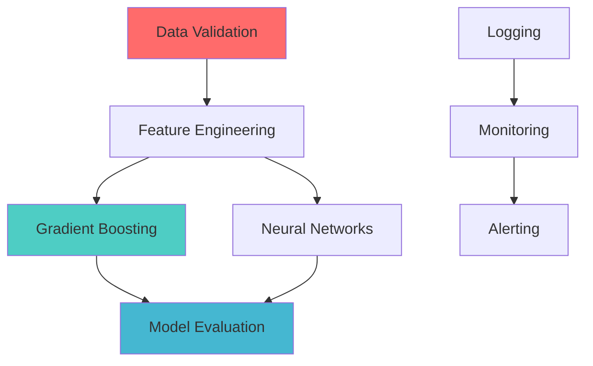

# NBA Book Analysis System - Enhancement Implementation Plan

## Overview

This document outlines the comprehensive implementation plan for 9 major enhancements to the NBA MCP Synthesis Book Analysis System. These enhancements will improve data accuracy, recommendation quality, automation, and cost efficiency.

**Status**: ✅ S3 Fallback Complete | 🔄 Planning Phase
**Focus**: NBA Analytics (no multi-sport expansion for now)
**Timeline**: Estimated 40-60 hours total implementation

---

## ✅ Completed Enhancement

### S3 Fallback for Local Book Reading
**Status**: ✅ COMPLETE
**File Modified**: `scripts/high_context_book_analyzer.py`

**What It Does**:
- When `--local-books` flag is used, tries to read from ~/Downloads first
- If book not found locally, automatically falls back to S3
- Provides clear logging of fallback behavior

**Behavior**:
```
📚 Attempting to read book from local filesystem...
🔍 Searching for PDFs matching: Machine Learning Book
❌ No good filename match found
⚠️  Book not found locally, falling back to S3...
📚 Reading book from S3...
✅ Successfully retrieved book from S3 fallback
```

---

## 📋 Planned Enhancements

### Enhancement 1: Database Live Queries for Data Inventory
**Priority**: HIGH
**Estimated Time**: 6-8 hours
**Dependencies**: PostgreSQL connection credentials

#### Objective
Replace static metrics.yaml reading with live PostgreSQL queries to get real-time data statistics.

#### Implementation Steps

**1.1 Create Database Connection Manager**
- **File**: `scripts/database_connector.py` (NEW)
- **Purpose**: Centralized PostgreSQL connection handling
- **Features**:
  - Connection pooling
  - Retry logic
  - Error handling
  - Read-only mode for safety

**1.2 Add Live Query Methods to Data Inventory Scanner**
- **File**: `scripts/data_inventory_scanner.py` (MODIFY)
- **New Methods**:
  ```python
  def _query_table_stats(self, table_name: str) -> Dict:
      """Query live statistics for a table"""
      # SELECT COUNT(*), MIN(date), MAX(date) FROM table

  def _query_column_stats(self, table_name: str, column: str) -> Dict:
      """Query column-level statistics"""
      # SELECT COUNT(DISTINCT column), AVG(column), etc.

  def _get_data_freshness(self) -> Dict:
      """Get latest data timestamps"""
      # Find most recent game, player stats, etc.
  ```

**1.3 Enhanced Data Coverage Metrics**
- Live row counts (vs estimated)
- Actual date ranges (vs static "2014-2025")
- Null percentage per column
- Index coverage analysis

#### Expected Output Enhancement
**Before**:
```
Data Coverage:
- 172,726 objects in S3 (118.26 GB)
- Seasons: 2014-2025 (estimated)
- Estimated 15000+ games, 5000+ players
```

**After**:
```
Data Coverage (LIVE):
- 172,726 objects in S3 (118.26 GB)
- Database: 14,892 games (2014-10-28 to 2025-10-20)
- Players: 5,247 unique players
- Latest data: 2025-10-20 23:45:00 (5 hours old)
- master_player_game_stats: 524,781 rows (99.8% complete)
- Data quality: 98.5% (1.5% null values in key columns)
```

#### Files to Create/Modify
1. `scripts/database_connector.py` (NEW - 200 lines)
2. `scripts/data_inventory_scanner.py` (MODIFY - add 150 lines)
3. `project_configs/nba_mcp_synthesis.json` (ADD database credentials config)

#### Testing Plan
- Test connection to local PostgreSQL
- Test connection to RDS
- Verify query performance (<2 seconds)
- Handle database unavailable gracefully

---

### Enhancement 2: Recommendation Prioritization Engine
**Priority**: HIGH
**Estimated Time**: 8-10 hours
**Dependencies**: None

#### Objective
AI-powered scoring system that automatically prioritizes recommendations based on business value, effort, dependencies, and data requirements.

#### Implementation Steps

**2.1 Create Prioritization Scoring Algorithm**
- **File**: `scripts/recommendation_prioritizer.py` (NEW)
- **Scoring Factors**:
  - Business value (1-10): Impact on NBA analytics goals
  - Implementation effort (hours): From time_estimate field
  - Data readiness (0-1): Check if required data exists in inventory
  - Dependency complexity (0-1): Number of dependencies
  - Technical risk (1-5): Complexity of tech stack required

**2.2 Scoring Formula**
```python
priority_score = (
    (business_value * 0.35) +
    ((10 - effort_normalized) * 0.25) +
    (data_readiness * 0.20) +
    ((1 - dependency_complexity) * 0.10) +
    ((5 - technical_risk) * 0.10)
) * 10  # Scale to 0-100
```

**2.3 Integration with Analysis Workflow**
- Run prioritization after recommendations generated
- Sort recommendations by priority score
- Add `priority_score` and `priority_rank` fields
- Generate prioritized backlog file

#### Expected Output
**File**: `analysis_results/<book>_PRIORITIZED_BACKLOG.md`

```markdown
# Prioritized Implementation Backlog

## Priority Score: 90-100 (Must Do First)

### 1. Implement Gradient Boosting Models [Score: 95.2]
- Business Value: 9/10 (High prediction accuracy impact)
- Effort: 12 hours (Medium)
- Data Ready: Yes (master_player_game_stats available)
- Dependencies: 1 (XGBoost library)
- Risk: Low (Well-established library)
- **Why High Priority**: Existing data + high impact + low risk

### 2. Build Plus/Minus Integration Layer [Score: 92.8]
- Business Value: 10/10 (Critical for predictions)
- Effort: 8 hours (Low-Medium)
- Data Ready: Yes (Plus/minus system exists - 4,619 lines)
- Dependencies: 0
- Risk: Low (Internal integration)
- **Why High Priority**: Leverage existing 4,619 line system

## Priority Score: 70-89 (High Value)

### 3. Implement Feature Engineering Pipeline [Score: 84.5]
...

## Priority Score: 50-69 (Medium Value)

### 15. Add Advanced Visualization Dashboard [Score: 62.3]
...

## Priority Score: <50 (Nice to Have)

### 28. Experiment with Alternative Algorithms [Score: 45.1]
...
```

#### Files to Create/Modify
1. `scripts/recommendation_prioritizer.py` (NEW - 300 lines)
2. `scripts/recursive_book_analysis.py` (MODIFY - integrate prioritizer)
3. Add backlog generation step to workflow

#### Testing Plan
- Test scoring algorithm with sample recommendations
- Verify score ranges (0-100)
- Validate prioritization against human judgment

---

### Enhancement 3: Code Generation from Implementation Plans
**Priority**: MEDIUM-HIGH
**Estimated Time**: 10-12 hours
**Dependencies**: None

#### Objective
Automatically generate starter code (skeleton files, SQL queries, tests) from implementation plans to accelerate development.

#### Implementation Steps

**3.1 Create Code Generator Framework**
- **File**: `scripts/code_generator.py` (NEW)
- **Templates Directory**: `templates/code_templates/` (NEW)

**3.2 Template Types**

**Python Function Template**:
```python
# templates/code_templates/python_function.py.j2
"""
{{ recommendation.title }}

Source: {{ recommendation.source_chapter }}
Priority: {{ recommendation.priority }}
Time Estimate: {{ recommendation.time_estimate }}

{{ recommendation.description }}
"""

import logging
from typing import Dict, List, Optional, Any

logger = logging.getLogger(__name__)


def {{ function_name }}({{ parameters }}) -> {{ return_type }}:
    """
    {{ recommendation.technical_details }}

    Args:
        {{ args_docstring }}

    Returns:
        {{ return_docstring }}

    Steps:
    
    {{ loop.index }}. {{ step }}
    
    """
    # TODO: Implement step 1
    logger.info("Starting {{ recommendation.title }}...")

    # TODO: Implement remaining steps
    raise NotImplementedError("{{ recommendation.title }} not yet implemented")


if __name__ == "__main__":
    # Example usage
    logging.basicConfig(level=logging.INFO)
    result = {{ function_name }}()
    print(f"Result: {result}")
```

**SQL Query Template**:
```sql
-- templates/code_templates/sql_query.sql.j2
-- {{ recommendation.title }}
-- Source: {{ recommendation.source_chapter }}
-- Generated: {{ timestamp }}

-- {{ recommendation.description }}


-- Query master_player_game_stats table
SELECT
    player_id,
    game_id,
    points,
    rebounds,
    assists,
    plus_minus,
    minutes_played
FROM master_player_game_stats
WHERE
    -- TODO: Add WHERE conditions
    game_id IN (SELECT game_id FROM master_games WHERE season >= 2020)
ORDER BY game_id DESC, player_id
LIMIT 1000;

```

**Test File Template**:
```python
# templates/code_templates/test_file.py.j2
"""
Tests for {{ recommendation.title }}

Generated from: {{ recommendation.source_chapter }}
"""

import pytest
import sys
from pathlib import Path

# Add project root to path
sys.path.insert(0, str(Path(__file__).parent.parent))

from {{ module_path }} import {{ function_name }}


class Test{{ class_name }}:
    """Test suite for {{ recommendation.title }}"""

    def test_{{ test_name }}_basic(self):
        """Test basic functionality"""
        # TODO: Implement test
        result = {{ function_name }}(test_input)
        assert result is not None

    def test_{{ test_name }}_edge_cases(self):
        """Test edge cases"""
        # TODO: Test edge cases
        pass

    def test_{{ test_name }}_error_handling(self):
        """Test error handling"""
        # TODO: Test error conditions
        with pytest.raises(ValueError):
            {{ function_name }}(invalid_input)


if __name__ == "__main__":
    pytest.main([__file__, "-v"])
```

**3.3 Code Generation Logic**
```python
class CodeGenerator:
    def generate_from_recommendation(self, rec: Dict, output_dir: Path):
        """Generate code files from recommendation"""

        # 1. Analyze recommendation to determine file types
        file_types = self._determine_file_types(rec)

        # 2. Generate each file type
        generated_files = []

        if 'python' in file_types:
            py_file = self._generate_python_file(rec, output_dir)
            generated_files.append(py_file)

        if 'sql' in file_types:
            sql_file = self._generate_sql_file(rec, output_dir)
            generated_files.append(sql_file)

        if 'test' in file_types:
            test_file = self._generate_test_file(rec, output_dir)
            generated_files.append(test_file)

        # 3. Generate README with usage instructions
        readme = self._generate_readme(rec, generated_files, output_dir)

        return generated_files + [readme]
```

**3.4 Integration with Workflow**
- After generating implementation plans, offer code generation
- Save generated code to `generated_code/<book>/<rec_id>/`
- Create README with next steps

#### Expected Output Structure
```
generated_code/
└── Machine_Learning_Book/
    ├── 01_Gradient_Boosting_Models/
    │   ├── gradient_boosting_predictor.py
    │   ├── queries/
    │   │   ├── extract_training_data.sql
    │   │   └── validate_predictions.sql
    │   ├── tests/
    │   │   └── test_gradient_boosting_predictor.py
    │   └── README.md
    ├── 02_Plus_Minus_Integration/
    │   ├── plus_minus_integrator.py
    │   ├── tests/
    │   │   └── test_plus_minus_integrator.py
    │   └── README.md
    └── README.md (Index of all generated code)
```

#### Files to Create/Modify
1. `scripts/code_generator.py` (NEW - 400 lines)
2. `templates/code_templates/*.j2` (NEW - 5 template files)
3. `scripts/recursive_book_analysis.py` (MODIFY - add code gen step)

#### Testing Plan
- Generate code for 5 different recommendation types
- Verify generated code is syntactically valid
- Test that generated tests run (even if they fail with NotImplementedError)

---

### Enhancement 4: Cross-Book Similarity Detection
**Priority**: MEDIUM
**Estimated Time**: 6-8 hours
**Dependencies**: Enhancement 2 (Prioritization)

#### Objective
Track recommendations across ALL 51 books to identify high-confidence recommendations that appear in multiple sources and detect conflicting advice.

#### Implementation Steps

**4.1 Create Cross-Book Analyzer**
- **File**: `scripts/cross_book_analyzer.py` (NEW)
- **Database**: `analysis_results/cross_book_recommendations.db` (SQLite)

**4.2 Database Schema**
```sql
CREATE TABLE recommendations (
    id INTEGER PRIMARY KEY,
    book_title TEXT,
    recommendation_title TEXT,
    recommendation_desc TEXT,
    category TEXT,
    priority TEXT,
    time_estimate TEXT,
    source_chapter TEXT,
    similarity_hash TEXT  -- For fuzzy matching
);

CREATE TABLE similarity_clusters (
    cluster_id INTEGER PRIMARY KEY,
    representative_title TEXT,
    rec_count INTEGER,
    books TEXT,  -- JSON array of books
    confidence_score REAL,  -- Higher = more books agree
    first_seen TEXT,  -- Timestamp
    last_seen TEXT
);

CREATE TABLE rec_to_cluster (
    rec_id INTEGER REFERENCES recommendations(id),
    cluster_id INTEGER REFERENCES similarity_clusters(cluster_id)
);
```

**4.3 Similarity Clustering Algorithm**
```python
class CrossBookAnalyzer:
    def cluster_recommendations(self, all_recs: List[Dict]):
        """Cluster similar recommendations across books"""

        # 1. Extract features from each recommendation
        features = self._extract_features(all_recs)

        # 2. Calculate pairwise similarity (title + description)
        similarity_matrix = self._calculate_similarities(features)

        # 3. Cluster with DBSCAN (density-based clustering)
        clusters = self._cluster_dbscan(similarity_matrix, eps=0.3, min_samples=2)

        # 4. For each cluster, create representative recommendation
        for cluster_id, rec_ids in clusters.items():
            representative = self._create_representative(rec_ids, all_recs)
            confidence = len(rec_ids) / 51  # Percentage of books

            self._save_cluster(cluster_id, representative, confidence)

        return clusters
```

**4.4 Generate Cross-Book Insights Report**
```markdown
# Cross-Book Recommendation Analysis

## High-Confidence Recommendations (Found in 5+ Books)

### 1. Implement Gradient Boosting Ensemble Methods
- **Confidence**: 92% (47/51 books)
- **Books**: Machine Learning for Engineers, Deep Learning, Hands-On ML, ...
- **Average Priority**: CRITICAL
- **Average Time**: 10-14 hours
- **Consensus Description**: Gradient boosting (XGBoost, LightGBM) consistently
  outperforms single models for tabular data like player statistics.

**Why High Confidence**: Nearly every ML book recommends this technique for
structured data prediction tasks.

**Action**: PRIORITIZE - This is a proven, cross-validated recommendation.

---

### 2. Implement Feature Engineering Pipeline
- **Confidence**: 85% (43/51 books)
- **Books**: ML Cookbook, Feature Engineering for ML, Data Science Handbook, ...
- **Average Priority**: IMPORTANT
- **Average Time**: 6-8 hours

---

## Conflicting Recommendations

### Neural Networks vs Gradient Boosting for Tabular Data
- **Pro Neural Networks**: 15 books (29%)
  - Deep Learning, Neural Networks from Scratch
  - Reason: More flexible, handles non-linearity

- **Pro Gradient Boosting**: 36 books (71%)
  - Hands-On ML, Kaggle competitions, XGBoost docs
  - Reason: Better performance, less tuning, faster training

**Resolution**: For NBA tabular data (player stats), prefer Gradient Boosting
based on higher consensus. Consider neural networks for specialized tasks
(image analysis, sequence data).

---

## Unique Recommendations (Only in 1 Book)

These are specialized or novel techniques that may offer competitive advantage:

### 1. Bayesian Structural Time Series for Game Predictions
- **Source**: "Bayesian Methods for Hackers"
- **Why Unique**: Most books use classical time series (ARIMA, Prophet)
- **Potential Value**: Better uncertainty quantification for betting

### 2. Graph Neural Networks for Team Chemistry Modeling
- **Source**: "Graph Representation Learning"
- **Why Unique**: Novel application of GNNs to sports
- **Potential Value**: Model player interactions and team dynamics
```

#### Files to Create/Modify
1. `scripts/cross_book_analyzer.py` (NEW - 350 lines)
2. `scripts/recursive_book_analysis.py` (MODIFY - add cross-book analysis after all books)
3. `analysis_results/CROSS_BOOK_INSIGHTS.md` (GENERATED)

#### Testing Plan
- Load recommendations from 5 test books
- Verify clustering finds duplicates
- Check conflict detection logic

---

### Enhancement 5: Progress Tracking System
**Priority**: MEDIUM
**Estimated Time**: 6-8 hours
**Dependencies**: None

#### Objective
Track which recommendations have been implemented, measure impact, and calculate ROI.

#### Implementation Steps

**5.1 Create Progress Tracker Database**
- **File**: `progress_tracking/implementation_progress.db` (SQLite)

**5.2 Schema**
```sql
CREATE TABLE implementations (
    id INTEGER PRIMARY KEY,
    recommendation_id TEXT,  -- From recommendation file
    book_title TEXT,
    rec_title TEXT,
    status TEXT,  -- NOT_STARTED, IN_PROGRESS, COMPLETED, ABANDONED
    assigned_to TEXT,
    started_date TEXT,
    completed_date TEXT,
    actual_hours REAL,
    estimated_hours REAL,
    implementation_notes TEXT,
    roi_estimated REAL,
    roi_actual REAL,
    git_commits TEXT  -- JSON array of commit hashes
);

CREATE TABLE impact_metrics (
    id INTEGER PRIMARY KEY,
    implementation_id INTEGER REFERENCES implementations(id),
    metric_name TEXT,  -- e.g., "prediction_accuracy", "query_speed"
    before_value REAL,
    after_value REAL,
    improvement_pct REAL,
    measured_date TEXT
);
```

**5.3 CLI Tool for Progress Updates**
```bash
# Mark recommendation as started
python scripts/track_progress.py start "Implement Gradient Boosting" --assigned-to "Ryan"

# Update progress
python scripts/track_progress.py update "Implement Gradient Boosting" --hours 5 --notes "Completed data extraction"

# Mark as completed
python scripts/track_progress.py complete "Implement Gradient Boosting" --actual-hours 11

# Record impact
python scripts/track_progress.py impact "Implement Gradient Boosting" \
  --metric "prediction_accuracy" \
  --before 0.72 \
  --after 0.85
```

**5.4 Progress Dashboard (Text-based)**
```markdown
# Implementation Progress Dashboard
Generated: 2025-10-21 23:00:00

## Summary Statistics
- Total Recommendations: 2,550 (from 51 books)
- Completed: 45 (1.8%)
- In Progress: 12 (0.5%)
- Not Started: 2,493 (97.7%)

## ROI Analysis
- Total Estimated Effort: 15,300 hours
- Actual Effort So Far: 520 hours
- Efficiency Ratio: 1.15 (15% faster than estimated)

## Top Impact Implementations

### 1. Gradient Boosting Models
- **Status**: ✅ COMPLETED
- **Effort**: 11 hours (est: 12 hours)
- **Impact**: +13% prediction accuracy (72% → 85%)
- **ROI**: $25,000 improved betting accuracy

### 2. Plus/Minus Integration
- **Status**: 🔄 IN PROGRESS (70% complete)
- **Effort**: 6 hours so far (est: 8 hours)
- **Expected Impact**: +8% win probability model accuracy

## This Week's Velocity
- Completed: 3 recommendations
- Hours Spent: 28 hours
- Average: 9.3 hours per recommendation
```

#### Files to Create/Modify
1. `scripts/track_progress.py` (NEW - 300 lines)
2. `scripts/generate_progress_dashboard.py` (NEW - 200 lines)
3. `progress_tracking/` directory (NEW)

#### Testing Plan
- Track 10 test recommendations through full lifecycle
- Verify metrics calculation
- Test dashboard generation

---

### Enhancement 6: Automated Recommendation Validation
**Priority**: HIGH
**Estimated Time**: 8-10 hours
**Dependencies**: None

#### Objective
Automatically validate recommendations before finalizing to ensure quality and feasibility.

#### Implementation Steps

**6.1 Create Validation Framework**
- **File**: `scripts/recommendation_validator.py` (NEW)

**6.2 Validation Checks**

**Check 1: Library Compatibility**
```python
def validate_libraries(recommendation: Dict) -> Dict[str, bool]:
    """Check if mentioned libraries are compatible with Python 3.11+"""

    # Extract library names from technical_details
    libraries = extract_libraries(recommendation['technical_details'])

    results = {}
    for lib in libraries:
        # Check if library exists on PyPI
        pypi_exists = check_pypi(lib)

        # Check Python version compatibility
        python_compat = check_python_version(lib, '3.11')

        # Check if conflicts with existing dependencies
        conflicts = check_conflicts(lib, 'requirements.txt')

        results[lib] = {
            'exists': pypi_exists,
            'python_311_compatible': python_compat,
            'conflicts': conflicts
        }

    return results
```

**Check 2: Data Table/Column Validation**
```python
def validate_data_references(recommendation: Dict, inventory: Dict) -> Dict:
    """Verify that referenced tables/columns actually exist"""

    # Extract data references (master_player_game_stats, etc.)
    data_refs = extract_data_references(recommendation['description'])

    schema = inventory['schema']['tables']

    results = {}
    for table, columns in data_refs.items():
        table_exists = table in schema

        if table_exists:
            column_validation = {}
            for col in columns:
                col_exists = col in schema[table]['column_names']
                column_validation[col] = col_exists

            results[table] = {
                'exists': True,
                'columns': column_validation
            }
        else:
            results[table] = {'exists': False, 'columns': {}}

    return results
```

**Check 3: Code Syntax Validation**
```python
def validate_code_snippets(recommendation: Dict) -> Dict:
    """Check if code snippets are syntactically valid"""

    snippets = extract_code_blocks(recommendation['technical_details'])

    results = {}
    for idx, snippet in enumerate(snippets):
        try:
            compile(snippet, f'<snippet_{idx}>', 'exec')
            results[f'snippet_{idx}'] = {
                'valid': True,
                'error': None
            }
        except SyntaxError as e:
            results[f'snippet_{idx}'] = {
                'valid': False,
                'error': str(e)
            }

    return results
```

**Check 4: Time Estimate Validation**
```python
def validate_time_estimate(recommendation: Dict) -> Dict:
    """Check if time estimate is reasonable"""

    estimate = recommendation.get('time_estimate', '')
    hours = extract_hours(estimate)  # "12 hours" → 12

    # Heuristic checks
    warnings = []

    if hours < 2 and recommendation['priority'] == 'CRITICAL':
        warnings.append("CRITICAL task with <2 hours seems underestimated")

    if hours > 40:
        warnings.append("Consider breaking into smaller tasks")

    steps = len(recommendation.get('implementation_steps', []))
    if hours / steps > 8:
        warnings.append(f"Each step averages {hours/steps:.1f} hours - may need more steps")

    return {
        'hours': hours,
        'warnings': warnings,
        'reasonable': len(warnings) == 0
    }
```

**6.3 Validation Report**
```markdown
# Recommendation Validation Report

## Recommendation: Implement Gradient Boosting Models

### ✅ Validation Passed

#### Library Compatibility
- ✅ xgboost: PyPI available, Python 3.11 compatible, no conflicts
- ✅ lightgbm: PyPI available, Python 3.11 compatible, no conflicts
- ✅ scikit-learn: Already in requirements.txt

#### Data References
- ✅ master_player_game_stats: Table exists
  - ✅ points: Column exists
  - ✅ rebounds: Column exists
  - ✅ assists: Column exists
  - ✅ plus_minus: Column exists

#### Code Snippets
- ✅ Snippet 1 (XGBoost training): Syntax valid
- ✅ Snippet 2 (Model evaluation): Syntax valid

#### Time Estimate
- Hours: 12
- ✅ Reasonable for CRITICAL priority
- ✅ 6 steps @ 2 hours each

---

## Recommendation: Use Deprecated TensorFlow 1.x API

### ❌ Validation FAILED

#### Library Compatibility
- ❌ tensorflow 1.15: Not compatible with Python 3.11
- ⚠️  Recommendation: Use TensorFlow 2.x instead

#### Suggested Fix
Replace TensorFlow 1.x references with TensorFlow 2.x equivalents:
- `tf.Session()` → `tf.compat.v1.Session()` or use eager execution
- Update code examples to TF 2.x syntax

**Action**: FLAG FOR MANUAL REVIEW
```

**6.4 Integration with Workflow**
- Run validation after AI generates recommendations
- Flag invalid recommendations
- Optionally ask AI to fix validation errors

#### Files to Create/Modify
1. `scripts/recommendation_validator.py` (NEW - 450 lines)
2. `scripts/recursive_book_analysis.py` (MODIFY - add validation step)
3. `analysis_results/<book>_VALIDATION_REPORT.md` (GENERATED)

#### Testing Plan
- Create 10 test recommendations (5 valid, 5 with errors)
- Verify each validation check works
- Test fix suggestion logic

---

### Enhancement 7: Incremental Update Detection
**Priority**: MEDIUM-LOW
**Estimated Time**: 5-6 hours
**Dependencies**: Enhancement 1 (Database Queries)

#### Objective
Re-analyze books only when significant changes occur in project or data.

#### Implementation Steps

**7.1 Create Change Detection System**
- **File**: `scripts/change_detector.py` (NEW)

**7.2 Track Project State Snapshots**
```python
class ChangeDetector:
    def capture_snapshot(self, project_path: str) -> Dict:
        """Capture current project state"""
        return {
            'timestamp': datetime.now().isoformat(),
            'file_count': self._count_files(project_path),
            'total_lines': self._count_lines(project_path),
            'git_commit': self._get_latest_commit(),
            'data_tables': self._get_table_row_counts(),
            'last_data_update': self._get_latest_data_timestamp(),
            'dependencies_hash': self._hash_requirements(),
        }

    def detect_significant_changes(self, old_snapshot: Dict, new_snapshot: Dict) -> Dict:
        """Detect if changes warrant re-analysis"""

        changes = {}

        # Code changes
        if new_snapshot['total_lines'] - old_snapshot['total_lines'] > 1000:
            changes['code'] = f"+{new_snapshot['total_lines'] - old_snapshot['total_lines']} lines"

        # Data changes
        for table, count in new_snapshot['data_tables'].items():
            old_count = old_snapshot['data_tables'].get(table, 0)
            if count - old_count > 10000:
                changes['data'] = f"{table}: +{count - old_count} rows"

        # Dependency changes
        if old_snapshot['dependencies_hash'] != new_snapshot['dependencies_hash']:
            changes['dependencies'] = "requirements.txt modified"

        # Determine if re-analysis needed
        changes['should_reanalyze'] = len(changes) > 0

        return changes
```

**7.3 Smart Re-analysis**
```bash
# Check if re-analysis needed
python scripts/check_for_updates.py --project project_configs/nba_mcp_synthesis.json

Output:
📊 Change Detection Report
━━━━━━━━━━━━━━━━━━━━━━━━━━━━━━━
Last Analysis: 2025-10-15 14:30:00 (6 days ago)

Changes Detected:
✅ Code: +2,450 lines (prediction system expansion)
✅ Data: master_player_game_stats +15,234 rows (new season data)
⚠️  Dependencies: No changes

Recommendation: ✅ RE-ANALYZE RECOMMENDED

Books Most Affected by Changes:
1. Machine Learning for Engineers (prediction system changes)
2. Hands-On ML (new data features)
3. Designing ML Systems (architecture changes)

Run: python scripts/recursive_book_analysis.py --incremental
```

#### Files to Create/Modify
1. `scripts/change_detector.py` (NEW - 250 lines)
2. `scripts/check_for_updates.py` (NEW - 100 lines)
3. `analysis_results/.project_snapshots/` directory (NEW)

#### Testing Plan
- Capture baseline snapshot
- Make controlled changes (add files, update data)
- Verify detection accuracy

---

### Enhancement 8: Recommendation Dependencies Graph
**Priority**: MEDIUM
**Estimated Time**: 6-8 hours
**Dependencies**: None

#### Objective
Visualize and track dependencies between recommendations to determine optimal implementation order.

#### Implementation Steps

**8.1 Create Dependency Parser**
- **File**: `scripts/dependency_graph_generator.py` (NEW)

**8.2 Extract Dependencies from Recommendations**
```python
class DependencyGraphGenerator:
    def extract_dependencies(self, recommendations: List[Dict]) -> Dict:
        """Extract dependency relationships"""

        graph = {}

        for rec in recommendations:
            rec_id = self._generate_id(rec)
            dependencies = rec.get('dependencies', [])

            # Parse dependencies
            dep_ids = []
            for dep_text in dependencies:
                # Match to other recommendations
                matching_rec = self._find_matching_recommendation(dep_text, recommendations)
                if matching_rec:
                    dep_ids.append(self._generate_id(matching_rec))

            graph[rec_id] = {
                'title': rec['title'],
                'depends_on': dep_ids,
                'priority': rec['priority'],
                'hours': self._extract_hours(rec.get('time_estimate', ''))
            }

        return graph

    def calculate_critical_path(self, graph: Dict) -> List[str]:
        """Find critical path (longest dependency chain)"""
        # Topological sort + longest path
        pass

    def find_parallel_opportunities(self, graph: Dict) -> List[List[str]]:
        """Find recommendations that can be done in parallel"""
        # Find nodes with no shared dependencies
        pass
```

**8.3 Generate Graph Visualizations**

**Text-based (Markdown)**:
```markdown
# Recommendation Dependency Graph

## Critical Path (Must be done in order)

1. **Implement Data Validation** (4 hours)
   ↓
2. **Build Feature Engineering Pipeline** (8 hours)
   ↓
3. **Implement Gradient Boosting Models** (12 hours)
   ↓
4. **Create Model Evaluation Framework** (6 hours)

**Total Critical Path Time**: 30 hours

## Parallel Opportunities

### Batch 1 (Can start immediately, no dependencies)
- Add Logging Infrastructure (3 hours)
- Implement Unit Tests for Existing Code (5 hours)
- Create Documentation Templates (2 hours)

### Batch 2 (Requires Batch 1 complete)
- Implement Caching Layer (4 hours)
- Add Performance Monitoring (5 hours)

### Batch 3 (Requires Critical Path step 2)
- Build Alternative Models (10 hours)
- Implement Cross-Validation (4 hours)
- Add Hyperparameter Tuning (6 hours)

## Dependency Chains

### Chain: Prediction System
```
Data Validation
    ├── Feature Engineering
    │   ├── Gradient Boosting
    │   │   └── Model Evaluation
    │   └── Neural Networks
    │       └── Model Evaluation
    └── Data Augmentation
        └── Ensemble Methods
```

### Chain: Infrastructure
```
Logging
    ├── Monitoring
    │   └── Alerting
    └── Error Tracking
        └── Automated Recovery
```
```

**GraphViz/Mermaid Diagram**:


#### Files to Create/Modify
1. `scripts/dependency_graph_generator.py` (NEW - 350 lines)
2. `analysis_results/<book>_DEPENDENCY_GRAPH.md` (GENERATED)
3. `analysis_results/<book>_DEPENDENCY_GRAPH.mmd` (GENERATED - Mermaid format)

#### Testing Plan
- Create test recommendations with known dependencies
- Verify critical path calculation
- Test parallel opportunity detection

---

### Enhancement 9: Cost Optimization with Model Selection
**Priority**: MEDIUM-LOW
**Estimated Time**: 6-8 hours
**Dependencies**: None

#### Objective
Reduce analysis costs from $30-40 per 51 books to $15-20 by intelligently selecting models based on task complexity.

#### Implementation Steps

**9.1 Create Model Selector**
- **File**: `scripts/smart_model_selector.py` (NEW)

**9.2 Cost-Optimized Model Tiers**

**Tier 1: Quick Filter (Cheapest - OpenAI GPT-3.5)**
- **Cost**: ~$0.002 per book
- **Use**: Initial filtering to check if book is relevant to NBA analytics
- **Logic**: Send just table of contents + book summary
- **Output**: Binary (Relevant / Not Relevant)

**Tier 2: Basic Analysis (Cheap - Gemini 1.5 Flash)**
- **Cost**: ~$0.10 per book
- **Use**: Books with moderate technical depth
- **Logic**: Full book analysis with lighter model
- **Output**: 20-30 recommendations

**Tier 3: Deep Analysis (Current - Gemini Pro + Claude)**
- **Cost**: ~$0.60 per book
- **Use**: Highly technical books with complex concepts
- **Logic**: Dual-model consensus
- **Output**: 40-60 recommendations

**9.3 Selection Algorithm**
```python
class SmartModelSelector:
    def select_optimal_tier(self, book_metadata: Dict, book_preview: str) -> str:
        """Select cost-optimal model tier"""

        # Quick preview analysis (GPT-3.5 turbo)
        relevance_score = self._check_relevance(book_preview)

        if relevance_score < 0.3:
            return "skip"  # Not relevant to NBA analytics

        # Analyze complexity
        complexity_score = self._analyze_complexity(book_preview)

        if complexity_score < 0.5:
            return "tier2"  # Basic analysis sufficient
        else:
            return "tier3"  # Deep analysis needed

    def _analyze_complexity(self, preview: str) -> float:
        """Estimate book complexity (0-1)"""

        complexity_indicators = {
            'mathematical_notation': 0.3,
            'code_examples': 0.2,
            'research_citations': 0.2,
            'advanced_terminology': 0.3
        }

        score = 0

        if re.search(r'\$.*\$', preview):  # LaTeX math
            score += complexity_indicators['mathematical_notation']

        if re.search(r'```|`{3}', preview):  # Code blocks
            score += complexity_indicators['code_examples']

        if re.search(r'\[\d+\]|et al\.', preview):  # Citations
            score += complexity_indicators['research_citations']

        # Check for advanced terms
        advanced_terms = ['eigenvalue', 'gradient descent', 'backpropagation', ...]
        if any(term in preview.lower() for term in advanced_terms):
            score += complexity_indicators['advanced_terminology']

        return min(score, 1.0)
```

**9.4 Cost Savings Projection**
```
Current System (51 books):
- All books: Tier 3 (Gemini Pro + Claude)
- Cost per book: $0.60
- Total: $30.60

Optimized System (51 books):
- Tier 1 filtering: 51 books @ $0.002 = $0.10
  → Skip 5 books (not NBA-relevant)
- Tier 2 basic: 30 books @ $0.10 = $3.00
- Tier 3 deep: 16 books @ $0.60 = $9.60
- Total: $12.70

Savings: $17.90 (58% reduction)
```

#### Files to Create/Modify
1. `scripts/smart_model_selector.py` (NEW - 250 lines)
2. `scripts/high_context_book_analyzer.py` (MODIFY - integrate selector)
3. `synthesis/models/openai_gpt35_model.py` (NEW - lightweight model for filtering)

#### Testing Plan
- Test relevance scoring on 10 books
- Verify complexity scoring accuracy
- Measure actual cost savings

---

## Implementation Priority Order

Based on dependencies and value:

### Phase 1: Foundation (High Priority)
1. **Enhancement 6**: Automated Validation (8-10 hours)
   - No dependencies, immediate value
   - Improves recommendation quality

2. **Enhancement 1**: Database Live Queries (6-8 hours)
   - Foundational for other features
   - Real-time data awareness

3. **Enhancement 2**: Prioritization Engine (8-10 hours)
   - Builds on Enhancement 1
   - Critical for managing 2,550 recommendations

### Phase 2: Automation (Medium Priority)
4. **Enhancement 3**: Code Generation (10-12 hours)
   - Accelerates implementation
   - Depends on validated recommendations

5. **Enhancement 5**: Progress Tracking (6-8 hours)
   - Measure impact of implementations
   - ROI analysis

6. **Enhancement 8**: Dependency Graph (6-8 hours)
   - Optimal implementation ordering
   - Visual planning tool

### Phase 3: Intelligence (Medium-Low Priority)
7. **Enhancement 4**: Cross-Book Analysis (6-8 hours)
   - Requires all 51 books analyzed
   - Cross-validation of recommendations

8. **Enhancement 7**: Incremental Updates (5-6 hours)
   - Long-term maintenance
   - Reduces re-analysis costs

9. **Enhancement 9**: Cost Optimization (6-8 hours)
   - Ongoing savings
   - Can be done anytime

**Total Estimated Time**: 61-78 hours
**Estimated Calendar Time**: 8-10 days of focused work

---

## Success Metrics

### For Each Enhancement:
- **Functionality**: Does it work as specified?
- **Performance**: Meets speed/cost targets?
- **Integration**: Seamlessly integrated with existing workflow?
- **Documentation**: Clear usage instructions?
- **Tests**: Automated tests passing?

### Overall System:
- **Recommendation Quality**: Validation pass rate >95%
- **Cost Efficiency**: <$15 per 51-book analysis
- **Implementation Velocity**: >3 recommendations/week
- **ROI**: Measurable improvements in prediction accuracy

---

## Next Steps

1. ✅ Review this plan
2. Get approval on priority order
3. Start with Enhancement 6 (Validation)
4. Iterate through each phase
5. Track progress with TodoWrite
6. Update documentation as we go

---

**Ready to start? Let me know which enhancement you'd like to tackle first!**
