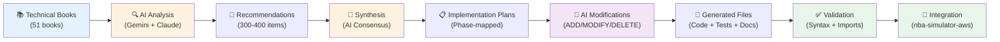

```mermaid
graph LR
    Books["📚 Technical Books<br/>(51 books)"]
    Analysis["🔍 AI Analysis<br/>(Gemini + Claude)"]
    Recs["📝 Recommendations<br/>(300-400 items)"]
    Synthesis["🔨 Synthesis<br/>(AI Consensus)"]
    Plans["📋 Implementation Plans<br/>(Phase-mapped)"]
    Mods["🤖 AI Modifications<br/>(ADD/MODIFY/DELETE)"]
    Files["📄 Generated Files<br/>(Code + Tests + Docs)"]
    Validation["✅ Validation<br/>(Syntax + Imports)"]
    Integration["🔗 Integration<br/>(nba-simulator-aws)"]

    Books --> Analysis
    Analysis --> Recs
    Recs --> Synthesis
    Synthesis --> Plans
    Plans --> Mods
    Mods --> Files
    Files --> Validation
    Validation --> Integration

    style Books fill:#e3f2fd
    style Analysis fill:#fff3e0
    style Synthesis fill:#fff3e0
    style Mods fill:#f3e5f5
    style Validation fill:#e8f5e9
    style Integration fill:#e8f5e9
```