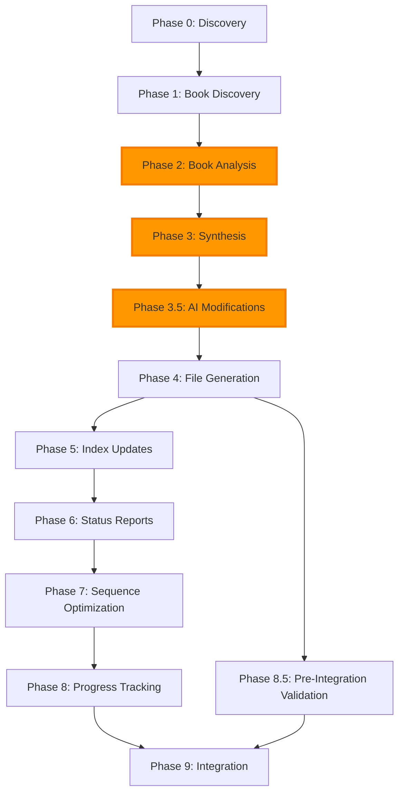

```mermaid
graph TD
    phase_0["Phase 0: Discovery"]
    phase_1["Phase 1: Book Discovery"]
    phase_2["Phase 2: Book Analysis"]
    phase_3["Phase 3: Synthesis"]
    phase_3_5["Phase 3.5: AI Modifications"]
    phase_4["Phase 4: File Generation"]
    phase_5["Phase 5: Index Updates"]
    phase_6["Phase 6: Status Reports"]
    phase_7["Phase 7: Sequence Optimization"]
    phase_8["Phase 8: Progress Tracking"]
    phase_8_5["Phase 8.5: Pre-Integration Validation"]
    phase_9["Phase 9: Integration"]
    phase_0 --> phase_1
    phase_1 --> phase_2
    phase_2 --> phase_3
    phase_3 --> phase_3_5
    phase_3_5 --> phase_4
    phase_4 --> phase_5
    phase_5 --> phase_6
    phase_6 --> phase_7
    phase_7 --> phase_8
    phase_4 --> phase_8_5
    phase_8 --> phase_9
    phase_8_5 --> phase_9

    %% Critical Path Styling
    style phase_2 fill:#ff9800,stroke:#f57c00,stroke-width:3px
    style phase_3 fill:#ff9800,stroke:#f57c00,stroke-width:3px
    style phase_3_5 fill:#ff9800,stroke:#f57c00,stroke-width:3px
```